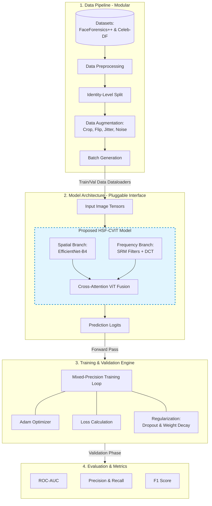

# DeepFakeDetection

Repository for deep fake detection algorithm.

## Architecture

High-level pipeline and model flow (HSF-CVIT–style design: modular data pipeline, pluggable model block, training/validation, and evaluation).

