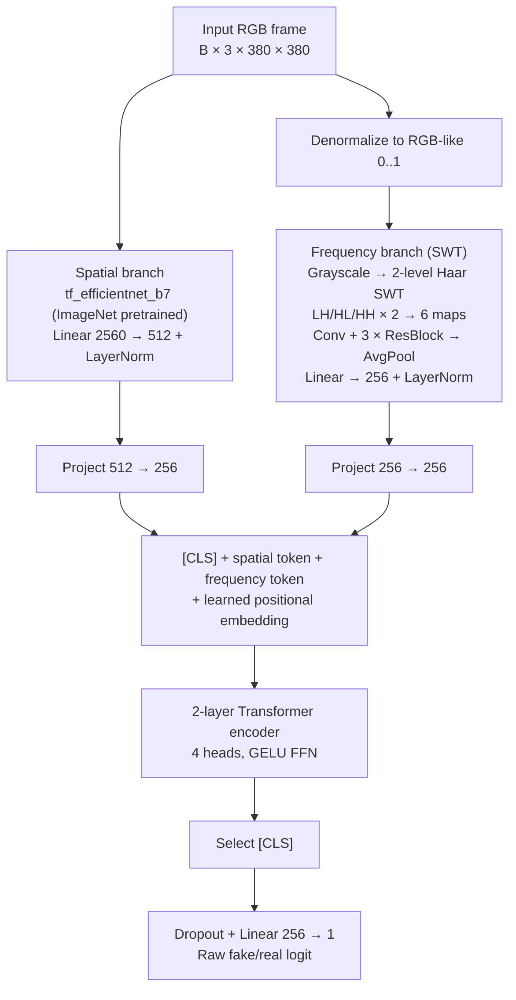

# DeepFakeDetection

A hybrid spatial–frequency deepfake detector built around **HSF-CVIT** (Hybrid Spatial-Frequency Cross-Attention Vision Transformer): an EfficientNet-B7 RGB branch and a two-level Haar SWT frequency branch, fused by a compact transformer encoder and trained on FaceForensics++ for frame-level real/fake classification.

> **Status (April 2026):** Best observed FaceForensics++ test ROC-AUC ≈ **0.906** (SWT + B7 checkpoint). Celeb-DF v2 cross-dataset evaluator is implemented; benchmark numbers pending local placement of the gated dataset. See [docs/training_run_summary.md](docs/training_run_summary.md).

---

## Highlights

- **Hybrid architecture** — RGB semantics (EfficientNet-B7) + forensic high-frequency cues (2-level Haar SWT) fused by a 3-token transformer encoder.
- **Configurable training stack** — official FaceForensics++ splits, weighted sampling, label smoothing, AMP, gradient clipping, threshold optimization, per-method reports.
- **Reproducible runtime** — Docker image with PyTorch/CUDA stack, single `start_container.sh` entrypoint.
- **End-to-end CLIs** — frame extraction, training, FF++ evaluation, single image/video inference, Celeb-DF v2 cross-dataset evaluation.

---

## Architecture



Full architecture details live in [docs/model_architecture_design.md](docs/model_architecture_design.md).

---

## Quickstart

### 1. Launch the container

```bash
./start_container.sh                # interactive shell
./start_container.sh --build        # rebuild after dependency changes
./start_container.sh --tensorboard  # http://localhost:6006
```

The project is mounted at `/workspace` inside the container.

### 2. Run inference on an image or video

```bash
python predict.py \
  --input path/to/file.mp4 \
  --checkpoint outputs/checkpoints/best.pt \
  --config configs/train_config.yaml \
  --frames 16 \
  --device cuda
```

JSON output for scripting: add `--json`. Output shape:

```json
{ "label": "fake", "probability": 0.8732, "threshold": 0.5,
  "frame_probs": [0.82, 0.91, 0.88], "num_frames_used": 16 }
```

### 3. Evaluate on FaceForensics++

```bash
python train.py \
  --config configs/train_config.yaml \
  --resume outputs/checkpoints/best.pt \
  --eval-only \
  --device cuda
```

Reports are written under `outputs/evaluation/` (`test_metrics.json`, `test_per_method.csv`, `test_predictions.csv`, `test_confusion_matrix.csv`).

### 4. Evaluate on Celeb-DF v2 (cross-dataset)

Place the gated dataset under `data/Celeb-DF-v2/` (see structure in [docs/UserGuide.md](docs/UserGuide.md)), then:

```bash
python evaluate_celeb_df.py \
  --checkpoint outputs/checkpoints/best_iteration_swt_b7.pt \
  --config configs/train_config.yaml \
  --dataset-root data/Celeb-DF-v2 \
  --frames 16 --device cuda
```

### 5. Train from scratch

```bash
python train.py --config configs/train_config.yaml --device cuda
```

Smoke test (1 epoch, tiny batch) and training options are documented in [docs/UserGuide.md](docs/UserGuide.md).

---

## Repository Layout

```text
configs/             YAML training & dataset configs, FF++ official splits
scripts/             Dataset download, frame extraction, audit, plotting utilities
src/data/            Datasets, transforms, dataloader factory
src/models/          Spatial branch, SWT branch, fusion head, top-level HSF-CVIT
src/training/        Trainer, losses, metrics, checkpointing, reports
src/inference/       DeepFakeDetector inference wrapper
src/utils/           Frame decoding, seeding, logging helpers
outputs/             Checkpoints, evaluation reports, logs, TensorBoard runs
data/                Local datasets and extracted frames
docs/                Project documentation (see map below)
predict.py           Single image/video inference CLI
evaluate_celeb_df.py Celeb-DF v2 evaluation CLI
train.py             Training and FF++ evaluation CLI
```

---

## Datasets

| Dataset | Role | Notes |
|---|---|---|
| FaceForensics++ (`c23`) | Default training & test | 4 manipulation methods (Deepfakes, Face2Face, FaceSwap, NeuralTextures) + `original_sequences/youtube`. Frames extracted to `data/frames_ffpp_standard/`. |
| Celeb-DF v2 | Cross-dataset evaluation only | Not merged into the training loader. Evaluator inverts label convention internally (project uses `1 = fake`). |

Detailed dataset configuration is in [docs/dataset_configuration_report.md](docs/dataset_configuration_report.md).

---

## Results Snapshot

From the strongest visible final run log ([outputs/logs/final_20260427_0322_clean.log](outputs/logs/final_20260427_0322_clean.log)):

| Metric (FF++ test) | Value |
|---|---:|
| ROC-AUC | **0.9062** |
| Average precision | 0.9731 |
| F1 (saved threshold = 0.63) | 0.8810 |
| Balanced accuracy | 0.8277 |

Per-method ROC-AUC:

| Deepfakes | Face2Face | FaceSwap | NeuralTextures |
|---:|---:|---:|---:|
| 0.9474 | 0.9253 | 0.9152 | 0.8368 |

`outputs/evaluation/test_metrics.json` is a mutable artifact and may reflect a later eval run rather than the best historical model — see [docs/training_run_summary.md](docs/training_run_summary.md) for the distinction between the best observed log and the latest report file.

---

## Documentation Map

Pick the document that matches what you want to do:

| If you want to... | Read |
|---|---|
| Run inference, evaluate, or use the CLIs | [docs/UserGuide.md](docs/UserGuide.md) |
| Understand the repository structure & entrypoints | [docs/repo_overview.md](docs/repo_overview.md) |
| Read implementation-level details | [docs/repo_technical_reference.md](docs/repo_technical_reference.md) |
| Understand the model architecture | [docs/model_architecture_design.md](docs/model_architecture_design.md) |
| Understand dataset configuration | [docs/dataset_configuration_report.md](docs/dataset_configuration_report.md) |
| See current evaluation artifacts | [docs/training_run_summary.md](docs/training_run_summary.md) |
| See the roadmap and known next steps | [docs/improvement_notes.md](docs/improvement_notes.md) |

---

## Known Limitations

- Frame-level model with no temporal modeling; video inference aggregates per-frame probabilities (`mean` or `max`).
- SWT filters are fixed (Haar); not learned.
- `NeuralTextures` is consistently the hardest of the four FF++ manipulation methods.
- Celeb-DF v2 generalization numbers are not yet measured.
- The legacy `srm_learnable` config field is accepted for backwards compatibility but no longer drives the active frequency branch.

---

## License

Released under the [MIT License](LICENSE).
