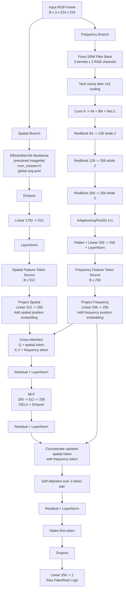

# HSF-CVIT Model Architecture Design

## Scope

This document describes the implemented model architecture in this repository at a layer-by-layer level. It focuses on the design currently defined in:

- [src/models/hsf_cvit.py](../src/models/hsf_cvit.py)
- [src/models/efficientnet_branch.py](../src/models/efficientnet_branch.py)
- [src/models/srm_filter.py](../src/models/srm_filter.py)
- [src/models/cross_attention_vit.py](../src/models/cross_attention_vit.py)

The model is named `HSF-CVIT`, short for `Hybrid Spatial-Frequency Cross-Attention Vision Transformer`.

Despite the name, this is not a pure patch-based Vision Transformer from raw image tokens. It is a hybrid detector built from:

- a CNN spatial encoder for semantic and appearance cues,
- an SRM-based frequency encoder for forensic artifacts,
- a transformer-style attention fusion head that combines the two feature streams.

## 1. Architectural Intent

The design tries to solve a common deepfake detection problem: manipulations can look visually plausible at the semantic level while still leaving subtle frequency-domain or high-frequency forensic traces.

The architecture therefore separates the problem into two complementary views of the same input frame:

- `Spatial view`: what the face and scene look like in RGB space.
- `Frequency / forensic view`: what residual noise and high-pass artifacts suggest about manipulation.

These views are encoded independently and fused late through attention. The late-fusion choice has two important consequences:

- each branch can specialize without immediately interfering with the other,
- the fusion head can learn how much artifact evidence to use for each learned visual pattern.

## 2. Top-Level Model Composition

At the highest level, the model takes a single RGB image tensor shaped `(B, 3, H, W)` and produces a binary classification logit shaped `(B, 1)`.

Default configuration from [configs/train_config.yaml](../configs/train_config.yaml):

- `spatial_out_dim = 512`
- `freq_out_dim = 256`
- `fusion_dim = 256`
- `fusion_heads = 4`
- `dropout = 0.3`
- `freeze_spatial_epochs = 2`

End-to-end logical flow:

1. The input image is sent into the spatial branch.
2. The same input image is sent into the frequency branch.
3. Each branch outputs one feature vector.
4. The fusion head converts those vectors into transformer-style tokens.
5. Cross-attention and self-attention combine the two tokens.
6. A final linear classifier outputs one raw logit.

## 3. End-to-End Tensor Flow

With the default config and a standard input size of `224 x 224`, the tensor flow is:

1. Input image: `(B, 3, 224, 224)`
2. Spatial branch output: `(B, 512)`
3. Frequency branch output: `(B, 256)`
4. Project both into fusion space: `(B, 1, 256)` and `(B, 1, 256)`
5. Cross-attention output: `(B, 1, 256)`
6. Pair refinement with self-attention over two tokens: `(B, 2, 256)`
7. Select first token: `(B, 256)`
8. Final classifier output: `(B, 1)`

The model returns raw logits, not probabilities. During training, the logits are consumed by `BCEWithLogitsLoss` via [src/training/losses.py](../src/training/losses.py). For inference, probabilities are obtained with `torch.sigmoid(logits)`.

## 4. Spatial Branch Design

Implementation: [src/models/efficientnet_branch.py](../src/models/efficientnet_branch.py)

### 4.1 Purpose

The spatial branch is responsible for high-level visual understanding in RGB space. It is where the model learns semantic appearance cues such as:

- face texture realism,
- blending quality,
- geometry and expression consistency,
- identity-level or rendering-level anomalies.

### 4.2 Backbone

The branch uses `EfficientNet-B4` from `timm`:

- model name: `efficientnet_b4`
- `pretrained=True` by default
- `num_classes=0`
- `global_pool="avg"`

This means the original classification head is removed and the model directly returns a pooled feature vector from the convolutional backbone.

The code comments indicate the backbone output dimension is `1792`.

### 4.3 Spatial Branch Layers

Layer sequence:

1. `EfficientNet-B4 backbone`
2. built-in global average pooling
3. `Dropout(p=0.3)` by default
4. `Linear(1792 -> spatial_out_dim)`
5. `LayerNorm(spatial_out_dim)`

With the default config:

- backbone output: `(B, 1792)`
- projection output: `(B, 512)`

### 4.4 Why This Branch Exists

EfficientNet is a strong image backbone for compact feature extraction. In this design it provides:

- strong pretrained image priors from ImageNet,
- efficient feature extraction relative to its capacity,
- a stable semantic embedding for the downstream fusion head.

This branch is the model's main source of content-aware understanding.

### 4.5 Freezing Strategy

The spatial backbone can be frozen and unfrozen through helper methods exposed by the branch and called by the trainer.

Training behavior from [src/training/trainer.py](../src/training/trainer.py):

- the EfficientNet backbone is frozen for the first `freeze_spatial_epochs`,
- only the non-frozen parts effectively update during that warm-up,
- after warm-up the backbone is unfrozen for full end-to-end training.

Design rationale:

- pretrained CNN features are already useful at initialization,
- the frequency branch and fusion head start from scratch,
- freezing early can reduce instability and let the new modules learn reasonable scales before full joint optimization.

## 5. Frequency Branch Design

Implementation: [src/models/srm_filter.py](../src/models/srm_filter.py)

### 5.1 Purpose

The frequency branch is designed to amplify forensic cues that may be weak in raw RGB space. It focuses on residual patterns and high-frequency inconsistencies that can be introduced by synthesis, blending, compression, warping, and frame-level editing artifacts.

### 5.2 SRM Filter Bank

The branch starts with three classical fixed SRM high-pass kernels built in `_build_srm_kernels()`:

- kernel 1: second-order residual
- kernel 2: Laplacian-style residual
- kernel 3: average residual pattern

These kernels are stored as non-trainable weights inside `SRMConv2d`.

### 5.3 Grouped Convolution Design

The SRM layer applies each kernel independently to each RGB channel:

- input channels: `3`
- kernels per channel: `3`
- total output channels: `9`
- grouped convolution uses `groups=3`

Shape transformation:

- input: `(B, 3, H, W)`
- SRM output: `(B, 9, H, W)`

This design keeps channel-specific residual responses separate at the filtering stage.

### 5.4 SRM Activation Clamp

Immediately after SRM filtering, the code applies:

`torch.tanh(noise * 10.0)`

This has two purposes:

- scale residual responses before nonlinearity,
- clamp extreme values in a way that matches common SRM-style preprocessing.

That step is important because raw high-pass responses can be noisy and unstable if passed directly into later trainable layers.

### 5.5 Trainable Residual Encoder

After the fixed filter bank, the branch uses a lightweight residual CNN encoder:

1. `Conv2d(9 -> 64, kernel_size=3, padding=1, bias=False)`
2. `BatchNorm2d(64)`
3. `ReLU`
4. `_ResBlock(64 -> 128, stride=2)`
5. `_ResBlock(128 -> 256, stride=2)`
6. `_ResBlock(256 -> 256, stride=2)`
7. `AdaptiveAvgPool2d(1)`

Projection head:

1. `Flatten`
2. `Linear(256 -> freq_out_dim)`
3. `LayerNorm(freq_out_dim)`

With the default config:

- pooled encoder output: `(B, 256, 1, 1)`
- projected frequency vector: `(B, 256)`

### 5.6 Residual Block Internals

Each `_ResBlock` contains:

1. `Conv2d(in_ch -> out_ch, 3x3, stride=stride, padding=1, bias=False)`
2. `BatchNorm2d(out_ch)`
3. `ReLU`
4. `Conv2d(out_ch -> out_ch, 3x3, padding=1, bias=False)`
5. `BatchNorm2d(out_ch)`
6. skip path:
   if shape changes, `Conv2d(1x1, stride=stride) + BatchNorm2d`
7. residual addition
8. final `ReLU`

This gives the branch a compact ResNet-like structure suitable for refining forensic residual maps after the fixed SRM preprocessing.

### 5.7 Why This Branch Exists

A standard RGB backbone can miss subtle manipulation traces when they do not strongly affect semantic appearance. The SRM branch exists to push the model toward:

- local residual artifacts,
- unnatural high-frequency statistics,
- compression and resampling patterns,
- synthesis fingerprints that survive even when faces look visually plausible.

In short, the spatial branch asks "does this image look fake?" while the frequency branch asks "does this image behave like manipulated content under residual analysis?"

## 6. Fusion Head Design

Implementation: [src/models/cross_attention_vit.py](../src/models/cross_attention_vit.py)

### 6.1 Purpose

The fusion head combines the two branch outputs using transformer-style attention. It is the component that turns two independent embeddings into one decision-ready representation.

This head is "ViT-like" because it works with learned tokens and multi-head attention, but it is much smaller than a full Vision Transformer:

- there are only two logical tokens,
- tokens come from branch embeddings rather than image patches,
- the attention module is used for modality fusion rather than full image encoding.

### 6.2 Input Tokens

The fusion head receives:

- `spatial_feat`: `(B, spatial_dim)` which is `(B, 512)` by default
- `freq_feat`: `(B, freq_dim)` which is `(B, 256)` by default

These are projected into a shared fusion space:

- `proj_spatial: Linear(spatial_dim -> fusion_dim)`
- `proj_freq: Linear(freq_dim -> fusion_dim)`

Then each is unsqueezed into one token:

- spatial token `q`: `(B, 1, fusion_dim)`
- frequency token `kv`: `(B, 1, fusion_dim)`

### 6.3 Learnable Positional Embeddings

The module adds two learnable parameters:

- `pos_spatial`: `(1, 1, fusion_dim)`
- `pos_freq`: `(1, 1, fusion_dim)`

Even though the sequence length is tiny, these embeddings give the model explicit token identity and help distinguish the roles of the two streams in attention.

### 6.4 Cross-Attention Block

The first attention stage is:

- query = spatial token
- key = frequency token
- value = frequency token

This is implemented with:

- `nn.MultiheadAttention(embed_dim=fusion_dim, num_heads=fusion_heads, batch_first=True)`

Default attention settings:

- `fusion_dim = 256`
- `fusion_heads = 4`
- head dimension = `256 / 4 = 64`

Interpretation:

- the spatial token asks what forensic evidence is relevant,
- the frequency token provides the artifact-based context,
- the result is a frequency-informed spatial representation.

This choice makes the fusion directional. The implemented design does not use symmetric bidirectional cross-attention.

### 6.5 Residual and Normalization After Cross-Attention

After cross-attention, the code performs:

1. residual addition with the original spatial token,
2. `LayerNorm`

Formally:

`q = norm1(q + attn_out)`

This preserves the original spatial signal while allowing the frequency branch to modify it.

### 6.6 MLP Block

The updated token then passes through a feed-forward block:

1. `Linear(fusion_dim -> fusion_dim * 2)`
2. `GELU`
3. `Dropout`
4. `Linear(fusion_dim * 2 -> fusion_dim)`
5. residual addition
6. `LayerNorm`

With the default config, this becomes:

- `Linear(256 -> 512)`
- `GELU`
- `Dropout(0.3)`
- `Linear(512 -> 256)`

This block increases representational capacity after attention mixing.

### 6.7 Pairwise Self-Attention Refinement

A second attention stage is applied after concatenating:

- the updated spatial token `q`,
- the projected frequency token `kv`

This creates a 2-token sequence:

- `pair = torch.cat([q, kv], dim=1)` giving `(B, 2, fusion_dim)`

The module then runs self-attention across both tokens:

- `self_attn(pair, pair, pair)`

This step lets the model refine the joint representation after the initial directional fusion. In practice it gives the model one extra interaction stage:

- cross-attention injects frequency evidence into the spatial token,
- self-attention lets the two-token pair settle into a jointly contextualized state.

### 6.8 Final Token Selection and Classifier

After self-attention:

- the first token is selected as the final representation,
- dropout is applied,
- a linear layer maps to one scalar logit.

Classifier sequence:

1. select `pair[:, 0, :]`
2. `Dropout`
3. `Linear(fusion_dim -> 1)`

With defaults:

- classifier input: `(B, 256)`
- classifier output: `(B, 1)`

The first token is effectively treated like a task token or CLS-style summary token, although it originates from the spatial stream rather than from an explicitly learned standalone `[CLS]` embedding.

## 7. Mermaid Design Chart

## 8. Design Rationale by Module

### 8.1 Why use a CNN for the spatial branch instead of a patch ViT backbone

This implementation favors a pretrained CNN backbone because:

- EfficientNet-B4 is compact and mature,
- transfer learning from ImageNet is straightforward,
- the project remains easier to train on moderate hardware,
- the architectural novelty is focused on hybrid fusion rather than replacing every stage with transformers.

### 8.2 Why use fixed SRM kernels instead of learning the first frequency layer

Using fixed high-pass filters injects prior forensic knowledge directly into the model. That can be useful because:

- deepfake artifacts often appear as subtle residual inconsistencies,
- a fixed forensic preprocessing layer can stabilize what the frequency branch sees,
- the trainable encoder can focus on combining residual patterns rather than rediscovering classical high-pass filters from scratch.

### 8.3 Why late fusion instead of early concatenation

The implemented design waits until each branch has produced a compact embedding before combining them. This is attractive because:

- branch-specific inductive biases are preserved longer,
- tensor sizes remain manageable,
- fusion logic stays modular,
- it is easier to ablate or replace one branch without redesigning the whole model.

### 8.4 Why directional cross-attention from spatial to frequency

The code uses:

- spatial token as query,
- frequency token as key and value.

This suggests the classifier is anchored in semantic understanding first, and forensic evidence is used as conditioning information rather than as the dominant representation. It is a meaningful design choice:

- semantic interpretation remains the main scaffold,
- artifact evidence is injected where needed,
- the final prediction still comes from the updated spatial token.

## 9. Training-Time Design Interactions

Although the trainer is separate from the model, several training choices are clearly part of the architecture's intended operation.

### 9.1 Loss

From [src/training/losses.py](../src/training/losses.py), training uses binary cross-entropy with logits, optional label smoothing, and optional class weighting.

Default smoothing:

- `label_smoothing = 0.05`

Smoothed targets become:

- real `0` becomes `0.025`
- fake `1` becomes `0.975`

Default class weighting:

- `pos_weight = 1.3`

This multiplies the BCE loss gradient for the fake (positive) class by 1.3, nudging the model toward higher fake probabilities and keeping the calibrated decision threshold near 0.5. The label smoothing reduces overconfidence and improves robustness to noisy labels.

### 9.2 Optimizer

Default optimizer from config:

- `AdamW`
- learning rate `3e-4`
- weight decay `1e-4`

This is a reasonable fit for a mixed architecture containing:

- pretrained CNN weights,
- trainable residual convolution blocks,
- small transformer-style fusion modules.

### 9.3 Learning-Rate Schedule

Default schedule:

- `warmup_epochs = 5`
- `lr_schedule = cosine`

The scheduler implementation uses linear warm-up followed by cosine annealing. This pairs well with:

- frozen early spatial training,
- newly initialized fusion layers,
- mixed-capacity modules that may otherwise optimize at different speeds.

### 9.4 Mixed Precision

When CUDA is available and AMP is enabled:

- autocast is used,
- GradScaler is used,
- gradient clipping is applied after unscaling.

This improves throughput while still protecting training stability.

## 10. What Makes This Model Distinct

The implementation is distinctive not because each individual component is novel on its own, but because of how the components are combined:

- pretrained semantic CNN branch,
- fixed forensic preprocessing branch,
- compact attention-based fusion,
- training schedule that protects the pretrained backbone early.

This creates a detector that is more structured than a single-stream classifier and more approachable than a large multi-stage transformer system.

## 11. Strengths of the Current Design

- Strong inductive bias for forensic artifact detection through SRM filters.
- Good transfer-learning starting point through pretrained EfficientNet-B4.
- Small and interpretable fusion head.
- Modular design that supports ablations branch by branch.
- Practical default dimensions for moderate-scale experimentation.

## 12. Limitations and Implementation Notes

### 12.1 Only one token per branch

The fusion head operates on one spatial token and one frequency token. This keeps the design simple, but it also means:

- attention is not modeling patch-level interactions,
- spatial localization is compressed before fusion,
- the transformer portion is lightweight rather than deeply expressive.

### 12.2 Frequency branch uses fixed handcrafted priors

The SRM stage may improve robustness to some artifacts, but it can also bias the detector toward known residual patterns and may not be optimal for all manipulation families.

### 12.3 Final decision is anchored to the spatial token

The classifier uses the first token after refinement. That means the final representation is still primarily organized around the spatial stream, even though it has been conditioned on frequency evidence.

### 12.4 Frame-level processing only

The dataset returns single frames (or averaged frame stacks for multi-frame settings). The model has no temporal component — frames from the same video are processed independently. Video-level inference improves accuracy by averaging per-frame probabilities, but temporal consistency signals are not exploited architecturally.

## 13. Summary

`HSF-CVIT` is best understood as a hybrid deepfake detector with three stages:

1. `Spatial encoding` with EfficientNet-B4 to capture semantic appearance cues.
2. `Frequency encoding` with fixed SRM filters plus a residual CNN to capture forensic artifacts.
3. `Attention-based fusion` where the spatial representation queries the frequency representation and then produces a final binary logit.

This gives the project a clear research-friendly structure:

- easy to explain,
- easy to ablate,
- strong enough to demonstrate modern hybrid deepfake detection ideas without becoming overly complex.
