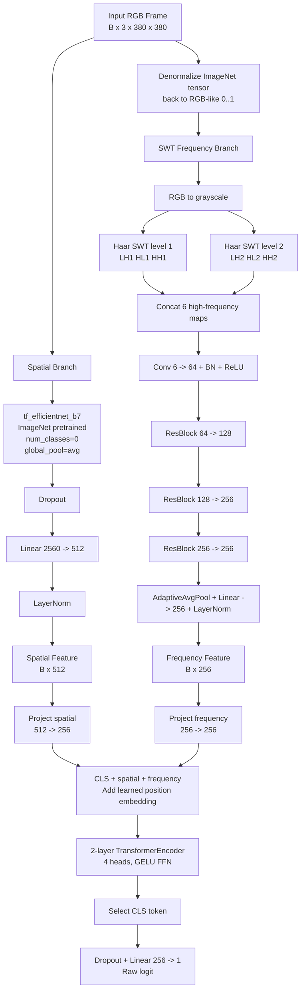

# HSF-CVIT Model Architecture Design

## Scope

This document describes the model architecture currently implemented in the repository. The active architecture is defined by:

- `src/models/hsf_cvit.py`
- `src/models/efficientnet_branch.py`
- `src/models/swt_filter.py`
- `src/models/cross_attention_vit.py`
- `configs/train_config.yaml`

The model is named `HSF-CVIT`, short for Hybrid Spatial-Frequency Cross-Attention Vision Transformer. In the current code, the name is best understood as a hybrid CNN/wavelet/transformer detector rather than a pure patch-based Vision Transformer.

## Current Architecture at a Glance

Default configuration:

```yaml
model:
  spatial_backbone: tf_efficientnet_b7
  pretrained_spatial: true
  freeze_spatial_epochs: 2
  spatial_out_dim: 512
  freq_out_dim: 256
  fusion_heads: 4
  fusion_dim: 256
  dropout: 0.4
data:
  image_size: 380
```

High-level flow:

```text
Input RGB tensor
├── EfficientNet spatial branch -> spatial vector
├── SWT frequency branch        -> frequency vector
└── 3-token transformer fusion  -> binary fake/real logit
```

The model returns one raw logit per image. `torch.sigmoid(logit)` gives `P(fake)`.

## Important Implementation Status

The active frequency branch is `SWTFrequencyBranch` from `src/models/swt_filter.py`. Older SRM code remains in `src/models/srm_filter.py`, but it is not used by the current top-level `HSF_CVIT` class.

`build_model(train_cfg)` passes `model.srm_learnable` into `HSF_CVIT`, but the current SWT branch does not consume that flag. The flag is therefore a legacy/config-compatibility field unless the model is later changed to use a learnable SRM front-end again.

## End-to-End Tensor Flow

With the default config:

```text
Input image                (B, 3, 380, 380)
Spatial branch output      (B, 512)
Frequency branch output    (B, 256)
Spatial token projection   (B, 1, 256)
Frequency token projection (B, 1, 256)
CLS token                  (B, 1, 256)
Fusion sequence            (B, 3, 256)
Transformer output         (B, 3, 256)
CLS representation         (B, 256)
Classifier output          (B, 1)
```

The exact spatial feature resolution inside EfficientNet depends on the `timm` backbone. The branch asks `timm` for pooled features by setting `num_classes=0` and `global_pool="avg"`, so downstream code only sees the pooled vector.

## Top-Level Module: `HSF_CVIT`

`src/models/hsf_cvit.py` composes three modules:

```python
self.spatial_branch = EfficientNetSpatialBranch(...)
self.freq_branch = SWTFrequencyBranch(...)
self.fusion_head = CrossAttentionViT(...)
```

The forward pass:

1. Sends normalized input tensors to the spatial branch.
2. Converts normalized tensors back to RGB-like `[0, 1]` image space for the frequency branch.
3. Sends spatial and frequency feature vectors into the fusion head.
4. Returns a raw binary logit.

The ImageNet denormalization step is important because the input transform normalizes frames for EfficientNet. SWT subband extraction should operate on image-space intensities, so the model registers ImageNet mean/std buffers and reconstructs the approximate RGB range before frequency analysis.

## Spatial Branch

Implementation: `src/models/efficientnet_branch.py`

### Purpose

The spatial branch learns semantic and appearance cues in RGB space:

- face texture realism,
- blending artifacts visible in normal color space,
- expression and geometry consistency,
- identity and rendering irregularities.

### Backbone

The branch wraps a `timm` model. The default config selects:

```text
tf_efficientnet_b7
```

Key settings:

- `pretrained=True` by default;
- `num_classes=0`;
- `global_pool="avg"`;
- output feature width read from `self.backbone.num_features`.

For the default B7 backbone, the reference feature width is 2560.

### Projection Head

The branch applies:

```text
Dropout(p=dropout)
Linear(backbone_out_dim -> spatial_out_dim)
LayerNorm(spatial_out_dim)
```

With the default config:

```text
Linear(2560 -> 512)
```

### Freeze/Unfreeze Behavior

The branch exposes:

- `freeze()`
- `unfreeze()`
- `is_frozen`

The trainer uses these helpers to freeze the EfficientNet backbone for the first `freeze_spatial_epochs`. This freezes backbone parameters, not the projection head. The projection head, SWT branch, and fusion head remain trainable.

## Frequency Branch

Implementation: `src/models/swt_filter.py`

### Purpose

The frequency branch captures forensic cues that may be weak in normal RGB space:

- high-frequency synthesis artifacts,
- local edge/noise irregularities,
- texture inconsistencies,
- manipulation traces that survive visually plausible rendering.

### SWT Front-End

The current branch uses a two-level stationary wavelet transform with fixed Haar filters.

Input:

```text
(B, 3, H, W)
```

First, RGB is converted to grayscale:

```text
gray = 0.299 R + 0.587 G + 0.114 B
```

For each SWT level, the branch computes:

- `LH`: horizontal/row high-pass with column low-pass response;
- `HL`: row low-pass with column high-pass response;
- `HH`: diagonal high-frequency response.

The implementation skips LL subbands because the spatial branch already models low-frequency semantic content.

With two levels:

```text
LH1, HL1, HH1, LH2, HL2, HH2 -> 6 maps
```

Output after concatenation:

```text
(B, 6, H, W)
```

The SWT is implemented in pure PyTorch with fixed registered buffers for Haar kernels. There is no external wavelet dependency.

### Frequency Encoder

After SWT extraction, the branch applies:

```text
Conv2d(6 -> 64, 3x3) + BatchNorm + ReLU
ResBlock(64 -> 128, stride=2)
ResBlock(128 -> 256, stride=2)
ResBlock(256 -> 256, stride=2)
AdaptiveAvgPool2d(1)
Flatten
Linear(256 -> freq_out_dim)
LayerNorm(freq_out_dim)
```

With the default config:

```text
freq_out_dim = 256
```

### Residual Block

Each residual block contains:

```text
Conv2d -> BatchNorm -> ReLU
Conv2d -> BatchNorm
optional 1x1 shortcut projection
residual add
ReLU
```

This gives the frequency branch enough trainable capacity to learn combinations of fixed wavelet subbands without making the wavelet filters themselves trainable.

## Fusion Head

Implementation: `src/models/cross_attention_vit.py`

### Purpose

The fusion head combines the spatial vector and frequency vector into one decision-ready representation. It uses transformer encoder layers over a very small token sequence.

### Token Construction

The fusion head learns:

- `proj_spatial: Linear(spatial_dim -> fusion_dim)`
- `proj_freq: Linear(freq_dim -> fusion_dim)`
- `cls_token: (1, 1, fusion_dim)`
- `pos_embed: (1, 3, fusion_dim)`

The sequence is:

```text
[CLS] + spatial token + frequency token
```

Shape:

```text
(B, 3, fusion_dim)
```

With defaults:

```text
(B, 3, 256)
```

### Transformer Encoder

The current fusion module uses:

```python
nn.TransformerEncoderLayer(
    d_model=fusion_dim,
    nhead=fusion_heads,
    dim_feedforward=fusion_dim * 4,
    dropout=dropout,
    activation="gelu",
    batch_first=True,
    norm_first=True,
)
```

and wraps it in:

```text
2-layer nn.TransformerEncoder + final LayerNorm
```

With `fusion_dim=256` and `fusion_heads=4`, each head has width 64.

### Classifier

After the transformer encoder:

```text
encoded[:, 0, :] -> Dropout -> Linear(256 -> 1)
```

The first token is the learned `[CLS]` token. This is the final summary representation used for classification.

## Mermaid Architecture Chart



## Training-Time Interactions

### Loss

Training uses `BCEWithLogitsLoss` through `src/training/losses.py`, with:

- optional label smoothing;
- optional positive-class weighting through `pos_weight`.

The default config currently sets:

```yaml
label_smoothing: 0.10
pos_weight: null
```

With smoothing `0.10`, hard labels are softened around the binary targets. This can reduce overconfidence and improve robustness to noisy labels.

### Optimization

Default training settings:

```yaml
optimizer: adamw
lr: 1.0e-4
weight_decay: 5.0e-4
warmup_epochs: 8
lr_schedule: cosine
gradient_clip: 1.0
amp: true
```

The trainer uses linear warm-up before the configured main scheduler when applicable.

### Evaluation Thresholding

Validation metrics are computed at the default threshold and, when enabled, over a threshold sweep:

```yaml
optimize_threshold: true
threshold_metric: balanced_accuracy
threshold_min: 0.05
threshold_max: 0.95
threshold_step: 0.01
```

When validation ROC-AUC improves, the current best threshold is saved in the checkpoint as `best_threshold`.

## Strengths of the Current Design

- Strong ImageNet-pretrained spatial backbone.
- Explicit high-frequency wavelet pathway.
- Small fusion transformer that is easy to inspect and ablate.
- Input normalization is handled correctly for both EfficientNet and wavelet analysis.
- Modular structure: branch and fusion components can be swapped independently.
- Works with frame-level training and video-level probability aggregation at evaluation/inference time.

## Limitations

### No temporal modeling inside the model

The model classifies frames independently. Video-level inference samples frames and aggregates probabilities, but there is no recurrent, 3D convolutional, or temporal-transformer component.

### Fusion token count is intentionally small

The fusion head operates on three tokens, not image patches. It is transformer-style fusion, not full image-token ViT modeling.

### SWT filters are fixed

The Haar SWT filters are not learned. This gives a stable forensic prior, but it may miss manipulation traces that are better represented by learned or adaptive filters.

### Config compatibility fields exist

The `srm_learnable` config field is present in the extended config and accepted by `HSF_CVIT`, but it has no effect on the active SWT branch.

## Summary

The current HSF-CVIT implementation is a practical hybrid detector:

- `tf_efficientnet_b7` learns visual and semantic evidence;
- SWT subbands expose multi-scale high-frequency forensic evidence;
- a compact transformer encoder fuses `[CLS]`, spatial, and frequency tokens;
- the final classifier outputs a single fake/real logit.

This architecture is suitable for FaceForensics++ training, checkpoint evaluation, and cross-dataset inference experiments on Celeb-DF v2.
